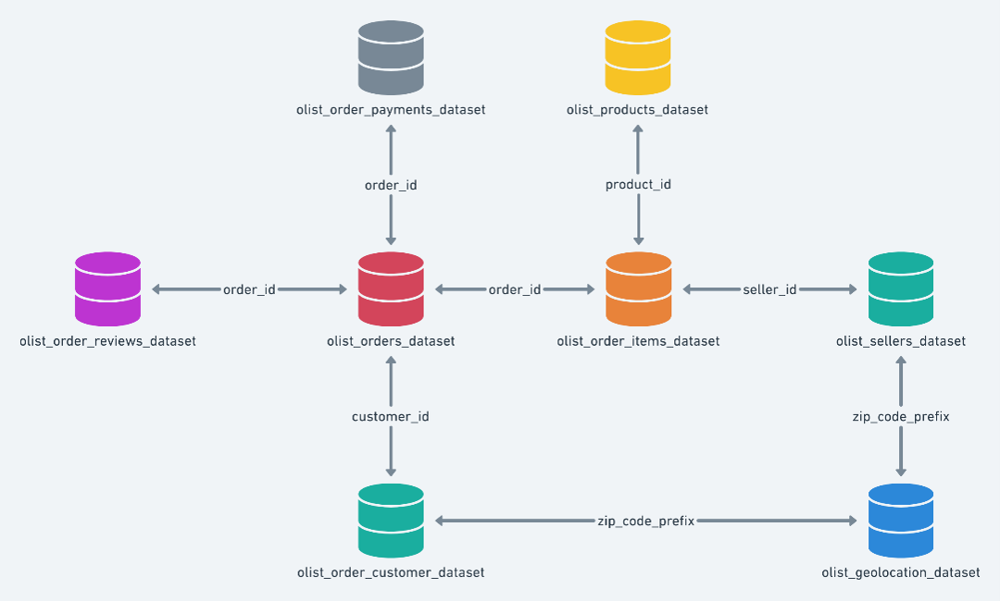
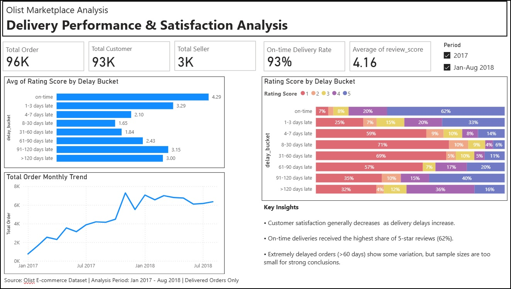

# Do Longer Delivery Delays Always Lead to Lower Customer Satisfaction?
An Analysis of Olist Marketplace

## Background & Overview
Olist is a Brazilian e-commerce platform that connects small and medium-sized sellers to multiple online marketplaces. As a marketplace intermediary, Olist operates in a complex logistics environment where a single customer order may include products from multiple sellers located across different regions. Combined with Brazil's large geographic area, this creates additional challenges in coordinating deliveries and maintaining consistent logistics performance.

As e-commerce activity grows, delivery reliability becomes increasingly important to customer experience. Delayed shipments may negatively affect customer satisfaction, particularly in marketplace businesses where fulfilment quality directly influences customer perception of the platform.

This project explores the relationship between delivery delays and customer satisfaction using Olist’s e-commerce dataset. The analysis focuses on delivered transactions in 2017 and 2018 and investigates whether longer delivery delays consistently lead to lower customer review scores.

In addition to evaluating the impact of delivery performance on customer satisfaction, the project also explores:
-	the Olist marketplace structure, 
-	the distribution of delivery delay severity, and 
-	product categories represented among extremely delayed orders.

## Data Structure Overview 
The Olist dataset consists of multiple relational tables covering orders, customers, sellers, products, payments, and customer reviews. For this analysis, six core tables were used: Orders, Order Items, Customers, Sellers, Reviews, and Products.

*Source: Olist Brazilian E-commerce Dataset (Kaggle).*

The analysis was conducted using SQL in BigQuery for data preparation and exploratory analysis, followed by data visualization in Power BI.

#### Key Data Relationships
Before conducting the analysis, several important business rules were identified:
-	An order may contain multiple items. 
-	Each item may be fulfilled by a different seller. 
-	A single order can therefore involve multiple sellers across different locations. 
-	Delivery timestamps are recorded at the order level rather than the item level. 
-	Customer reviews and delivery dates are available only at the order level, requiring item-level data to be aggregated before evaluating customer experience metrics.
These relationships were important when designing SQL joins and determining the appropriate level of aggregation throughout the analysis.

## Executive Summary
This analysis explores the relationship between delivery performance and customer satisfaction on the Olist marketplace. The following key findings summarize the main insights and business implications identified throughout the project.
### 1. Most delivered orders arrived on time.
Approximately 93% of delivered orders were completed on or before the estimated delivery date, indicating that Olist maintained a relatively strong delivery performance throughout the analysis period.

### 2. Customer satisfaction generally decreases as delivery delays increase.
Average review scores showed a clear downward trend across delay buckets, suggesting a strong negative relationship between delivery delays and customer satisfaction.

### 3. Delivery performance is important, but not the only driver of customer satisfaction.
Even among on-time deliveries, only 62% of orders received a 5-star rating. This indicates that while timely delivery contributes to positive customer experiences, other factors—such as product quality, packaging, or customer expectations—also influence review outcomes.

### 4. Results for extremely delayed orders should be interpreted with caution.
Orders delayed by more than 60 days exhibited some variation in review patterns; however, these categories contained relatively few observations. As a result, they should be treated as exploratory findings rather than definitive conclusions.

## Dashboard Overview
The dashboard below summarizes the key findings of the analysis, highlighting delivery performance, customer satisfaction, and the relationship between delivery delays and review ratings. Interactive filters allow users to compare results between 2017 and January–August 2018.

## Limitations
### 1. Dataset Time Coverage 

The analysis covers delivered orders from January 2017 to August 2018. Since 2018 does not represent a complete calendar year, comparisons involving annual business growth or year-over-year performance were intentionally avoided to prevent misleading conclusions.

### 2. Delivered Orders Only
The analysis focuses exclusively on delivered orders. Orders with other statuses (e.g., canceled, unavailable, or processing) were excluded because delivery performance and customer review ratings cannot be evaluated consistently for incomplete transactions.

### 3. Order-Level vs Item-Level Granularity
Delivery timestamps and customer review ratings are recorded at the order level, whereas products and sellers exist at the item level. Therefore, analyses involving product categories or sellers were treated as supporting observations rather than direct evidence of the impact of delivery delays on customer satisfaction.

### 4. Small Sample Size for Extreme Delays
Orders delayed by more than 60 days account for only a small proportion of the dataset. Findings related to these delay categories should therefore be interpreted as exploratory rather than conclusive.

## Insights Deep Dive
### Delivery Performance Remained Strong Throughout the Analysis Period

Monthly order volume grew from around 800 orders in January 2017 to over 6,000 orders by August 2018. Despite this substantial increase in order volume, approximately 93% of delivered orders continued to arrive on or before the estimated delivery date, suggesting that Olist was able to sustain its delivery performance while scaling its marketplace operations.

### Customer Satisfaction Generally Declines as Delivery Delays Increase
Customer review ratings generally declined as delivery delays increased, suggesting a strong relationship between delivery performance and customer satisfaction. Orders delivered on or before the estimated delivery date achieved the highest average review score (4.29), while longer delivery delays were associated with progressively lower ratings. 

Although the average review score appears to improve for delays exceeding 60 days, these categories account for less than 0.1% of delivered orders. As a result, this pattern is more likely to reflect the limited sample size than a meaningful improvement in customer satisfaction. Overall, the findings indicate that delivering orders on time plays an important role in maintaining customer satisfaction.

### Delivery Performance Alone Does Not Fully Explain Customer Satisfaction
Although on-time deliveries achieved the highest average review score, only 62% of these orders received a 5-star rating. This suggests that delivery performance, while important, does not fully explain customer satisfaction. Factors beyond logistics—such as product quality, packaging, or overall customer expectations—may also contribute to customers' evaluations, although these aspects were outside the scope of this analysis. Overall, the findings indicate that improving delivery performance alone is unlikely to maximize customer satisfaction.

## Recommendations
### 1. Maintain delivery performance while supporting future growth.
Olist demonstrated strong delivery performance throughout the analysis period, with most delivered orders arriving on or before the estimated delivery date. As order volume continues to grow, maintaining logistics capacity and monitoring delivery performance will be important to preserve service quality.
### 2. Prioritize efforts to reduce extended delivery delays.
Although delayed deliveries represented a relatively small proportion of total orders, customer satisfaction declined as delivery delays increased. Identifying operational bottlenecks and addressing the causes of longer delays could help improve the overall customer experience.
### 3. Investigate additional drivers of customer satisfaction.
While delivery performance showed a clear relationship with customer satisfaction, it did not fully explain customer review outcomes. Future analysis could explore other factors influencing customer experience, enabling more targeted improvement initiatives.

